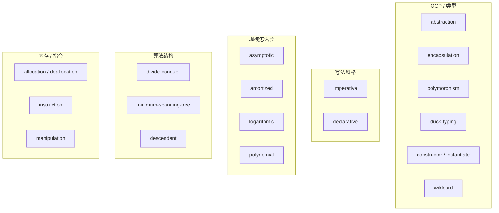

# OOP / 范式 / 复杂度相关单词及含义

整理自背单词过程中问过的一组词。词库以 [`data/interview.json`](../data/interview.json) 为准；和「转换」强相关的另见 [转换 / 变换 相关单词及含义](./转换变换%20相关单词及含义.md)。



---

## 1. OOP：藏细节、装胶囊、多形态

这组说的是：**对象怎么对外暴露、对内保护、同一接口多种表现**。

| 单词 | 词库释义 | 编程含义 | 记忆 |
|---|---|---|---|
| [abstraction](../data/interview.json)（id 19） | 抽象 | 藏起细节，只露「是什么、干什么」。开车只碰方向盘，不碰活塞 | abstract = 抽走细节 |
| [encapsulation](../data/interview.json)（id 56，已收藏） | 封装 | 把状态和实现封进「胶囊」，外面只能走公开接口 | **en + capsule**：装进胶囊 |
| [polymorphism](../data/interview.json)（id 108，错词+收藏） | 多态 | 同一调用，不同类型可以有不同表现：`animal.speak()` | **poly** 多 + **morph** 形态 |
| [duck-typing](../data/interview.json)（id 52，已标简单） | 鸭子类型 | 不看血统，只看会不会：走起来像鸭子、叫起来像鸭子就是鸭子 | 按能力用，不按类型名用 |

对照：

| | abstraction | encapsulation |
|---|---|---|
| 问什么 | 少看细节 | 不准伸手改内部 |
| 侧重点 | 接口 / 概念 | 可见性 / 数据保护 |

```text
// polymorphism + duck typing（Python 味道）
for x in [Dog(), Cat(), Horn()]:
    x.speak()   # 有 speak() 就能进循环，不必共有父类
```

---

## 2. 造对象：constructor / instantiate

| 单词 | 词库释义 | 编程含义 | 记忆 |
|---|---|---|---|
| [constructor](../data/interview.json)（id 38） | 构造函数 | 造实例时跑的初始化；`new` / 类构造器 | construct = 建造；**-or** = 干这事的人 |
| [instantiate](../data/interview.json)（id 80，错词+收藏） | 实例化 | 根据类（模板）**真的做出一个实例** | instance + **-ate** = 使成为实例 |

成对记：

- **constructor**：图纸上的建造工序  
- **instantiate**：按下模具做出饼干的动作  
- 产物叫 **instance（实例）**；别和 **install（安装软件）** 混

```js
class Button {
  constructor(label) { this.label = label; } // constructor
}
const ok = new Button("OK"); // instantiate → instance
```

---

## 3. 通配与约定：wildcard / convention（vs convert）

| 单词 | 词库释义 | 编程含义 | 记忆 |
|---|---|---|---|
| [wildcard](../data/interview.json)（id 140，已收藏） | 通配符 | 任意匹配的占位：`*.ts`、`LIKE 'con%'`、`List<?>` | wild 任意 + card 牌 → 百搭牌 |
| [convention](../data/interview.json)（id 3） | 约定 | 大家走到一起的规矩：命名 convention、约定大于配置 | **con + vent（来）**：走到一起来 |
| convert（词库未收动词） | — | 把 A **转成** B：`Number("1")` | **con + vert（转）** |

**convention vs convert**（长得像，词根不同）：

| | convention | convert / conversion |
|---|---|---|
| 核心语素 | **vent** = 来 | **vert** = 转 |
| 意思 | 惯例、大会、约定 | 转换 |
| 词性 | 名词为主 | convert 动词；[conversion](../data/interview.json)（id 40）名词 |

> We follow the naming **convention**.  
> **Convert** the string to a number.

---

## 4. 类型怎么转：coercion / conversion

详细例子见 [转换 / 变换](./转换变换%20相关单词及含义.md)。这里只留口诀：

| 单词 | 词库释义 | 谁动手 | 口诀 |
|---|---|---|---|
| [coercion](../data/interview.json)（id 32，已标错词） | 强制转换 | **语言**偷偷转 | coerce = 强迫；隐式 |
| [conversion](../data/interview.json)（id 40，已收藏） | 转换 | 总称；常指你**明确**要求转 | convert = 转；显式时常配 casting |

```js
1 + "2";      // coercion：引擎自己转
Number("2");  // conversion：你主动转
```

中文「强制转换」容易和 **casting（显式）** 撞车；背的时候用：**coercion = 隐式强制，casting = 显式转换**。

---

## 5. 写法风格：imperative / declarative

| 单词 | 词库释义 | 编程含义 | 记忆 |
|---|---|---|---|
| [imperative](../data/interview.json)（id 73，错词+收藏） | 命令式 | 一步步下命令：先做这个，再做那个（循环、赋值、if） | imperial / 皇帝 → 下命令 |
| [declarative](../data/interview.json)（id 43，已收藏） | 声明式 | 说要什么，少说怎么做：SQL、React JSX、`filter/map` | declare = 声明 |

```js
// imperative
const out = [];
for (const n of nums) if (n > 0) out.push(n * 2);

// declarative
const out2 = nums.filter(n => n > 0).map(n => n * 2);
```

---

## 6. 复杂度：asymptotic / amortized / logarithmic / polynomial

这组说的是：**规模变大时，成本怎么长；以及均摊后每次多贵**。

| 单词 | 词库释义 | 编程含义 | 记忆 |
|---|---|---|---|
| [asymptotic](../data/interview.json)（id 146，已收藏） | 渐进 | n → ∞ 时的增长趋势；Big-O 那套。词源希腊 *asymptōtos*「不相交却靠近」 | 看见就翻译成：**大 O / 规模很大时** |
| [amortized](../data/interview.json)（id 143，已收藏） | 摊还 | 偶发很贵、多数很便宜，把总账**摊到很多次**上 | 房贷分期还；动态数组 push 均摊 O(1) |
| [logarithmic](../data/interview.json)（id 189） | 对数 | O(log n)：折半、平衡树、二分 | log = 对数 |
| [polynomial](../data/interview.json)（id 198，已收藏） | 多项式 | O(nᵏ) 这类；相对指数爆炸仍算「可接受的多项式时间」 | poly 多 + nomial 项 |

成对对比：

| | amortized | asymptotic |
|---|---|---|
| 看什么 | 很多次操作的**均摊** | 输入变大时的**增长趋势** |
| 例子 | amortized O(1) push | asymptotic O(n²) 排序最坏 |

拆音节硬记 asymptotic：`a-symp-TOT-ic`（重音在 TOT）= a（不）+ sym（一起）+ tot（倒）→ 不会倒到一块 → 渐近。

```text
3n² + 100n + 5  →  asymptotic 上就是 O(n²)
vector.push     →  偶发 O(n) 扩容，amortized O(1)
```

---

## 7. 算法结构：conquer / MST / descendant

| 单词 | 词库释义 | 编程含义 | 记忆 |
|---|---|---|---|
| divide-conquer（词库作 [divide-conquer](../data/interview.json)） | 分治 | 大问题拆小、分别解决再合并：归并、快排、二分 | divide 分 + **conquer** 征服 |
| [minimum-spanning-tree](../data/interview.json)（id 194，已收藏） | 最小生成树 | 连通所有顶点、边权总和最小的树：Kruskal / Prim | minimum 最小 + spanning 生成 + tree 树 |
| [descendant](../data/interview.json)（id 170） | 后代节点 | 树上某节点的子孙；DOM 里也说 descendant | descend = 下降 → 往下走的后代 |

`conquer` 单独不在词库里，出现在 **divide-and-conquer（分治）** 固定搭配中。

---

## 8. 内存与指令：allocation / deallocation / instruction / manipulation

| 单词 | 词库释义 | 编程含义 | 记忆 |
|---|---|---|---|
| [allocation](../data/interview.json)（id 229，已标简单） | 分配 | 向堆/池要一块内存：`malloc`、`new` | allocate = 分配 |
| [deallocation](../data/interview.json)（id 233） | 释放 | 把内存还回去：`free`、`delete`、GC 回收 | **de-** 反向 + allocation |
| [instruction](../data/interview.json)（id 240） | 指令 | CPU 执行的一条机器指令；也泛指「说明/指示」 | instruct = 指示 |
| manipulation（词库有 [bit-manipulation](../data/interview.json)） | — | 用手摆弄 → 操作/操控；字符串、DOM、位运算 manipulation | **manu** = 手（manual、manuscript 同根） |

```text
allocation   →  要内存
deallocation →  还内存
bit-manipulation → 用位运算摆弄比特
```

---

## 9. 一张总对照（易混）

| 易混对 | 怎么分 |
|---|---|
| abstraction / encapsulation | 少看细节 vs 不准乱改 |
| constructor / instantiate | 建造工序 vs 造出来的动作 |
| convention / convert | vent=来（约定）vs vert=转（转换） |
| coercion / conversion / casting | 语言隐式 / 总称 / 程序员显式 |
| imperative / declarative | how vs what |
| amortized / asymptotic | 均摊成本 vs 增长趋势 |
| allocation / deallocation | 分配 vs 释放 |

---

## 10. 词库里没有的相关形态

| 英文 | 说明 |
|---|---|
| convert / converter | 动词/名词「转换」；词库有 conversion |
| conquer（单独） | 收录在 divide-conquer |
| manipulation（单独） | 收录在 bit-manipulation |
| amortize / asymptote | 动词 / 渐近线；词库有 amortized、asymptotic |
| declarative 的反面写法名 | 已有 imperative；函数式另见 functional 等（若词库有） |

若要补全：可加 `convert`（v. 转换）与 `conversion` 成对；`manipulation`（n. 操作）与 `bit-manipulation` 成组。
