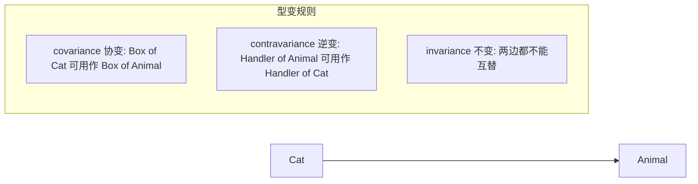

# Variance 相关单词及含义

词库 [`data/vocabulary.json`](../data/vocabulary.json) 里，和 **variance** 真正成组的是下面 4 个名词。另有 3 个 `variable` 条目是同词根、不同概念。

## 1. 型变家族（Programming Basics）

这组词描述的是：**泛型类型如何“跟着”子类型关系一起变**。

设 `Cat` 是 `Animal` 的子类型。问题是：`Box<Cat>` 和 `Box<Animal>` 谁能当谁用？

| 单词 | 词库释义 | 编程含义 |
|---|---|---|
| [covariance](../data/vocabulary.json)（id 41） | 协变 | **输出方向**保持子类型关系。`Cat` → `Animal`，则 `Producer<Cat>` 可当作 `Producer<Animal>`。Java：`List<? extends Animal>`；Kotlin：`out T`。口诀：Producer Extends |
| [contravariance](../data/vocabulary.json)（id 39，已标错词） | 逆变 | **输入方向**把子类型关系反过来。`Cat` → `Animal`，则 `Consumer<Animal>` 可当作 `Consumer<Cat>`（能处理动物的，一定能处理猫）。Java：`Comparator<? super Cat>`；Kotlin：`in T`。口诀：Consumer Super |
| [invariance](../data/vocabulary.json)（id 84，已收藏） | 不变 | **两边都不能替**。Java 的 `List<T>` 默认不变：`List<Cat>` 不是 `List<Animal>`，反过来也不是。这是为了类型安全（否则能往“动物列表”里塞狗） |
| [variance](../data/vocabulary.json)（id 1030） | **方差**（见下一节） | 在类型系统里，**variance / 型变** 是上面三种规则的总称。本词库把这个英文词放在 Performance，中文写成了「方差」，指的是统计含义，不是型变 |

记忆：

- **co-** = 同向：子类型关系方向不变
- **contra-** = 反向：子类型关系翻转
- **in-** = 不参与变化
- PECS：Producer Extends（协变），Consumer Super（逆变）

## 2. 统计方差（Performance）

| 单词 | 词库释义 | 含义 |
|---|---|---|
| [variance](../data/vocabulary.json)（id 1030，category **Performance**） | 方差 | 数据相对均值的离散程度，\(E[(X-\mu)^2]\)。性能场景里常看延迟/吞吐的波动：均值好看但 variance 高，说明尾延迟不稳定。标准差是它的平方根 |

注意：同一英文 **variance** 有两套含义。本词库只收录了统计义「方差」，没有收录类型系统义「型变」。

## 3. 同词根但不是 variance：variable

| 单词 | 词库释义 | 分类 | 含义 |
|---|---|---|---|
| [variable](../data/vocabulary.json)（id 136） | 变量 | Programming Basics | 可赋值的存储名 |
| [atomic-variable](../data/vocabulary.json)（id 403） | 原子变量 | Concurrency | 不可分割更新的共享变量（如 `AtomicInteger`） |
| [environment-variable](../data/vocabulary.json)（id 544） | 环境变量 | Java Ecosystem | 进程从操作系统拿到的 `KEY=value` 配置 |

词根 *vari-* 都是「变化」，但 **variable = 可变的东西**，**variance = 变化的方式/程度**。

## 词库里没有的相关形态

未收录：`covariant` / `contravariant` / `invariant`（形容词）、`variant`、`variation`。若要补类型系统总称，需要另加一条 `variance` = 型变（会和现有「方差」条目冲突，应用不同 category 或不同中文区分）。
