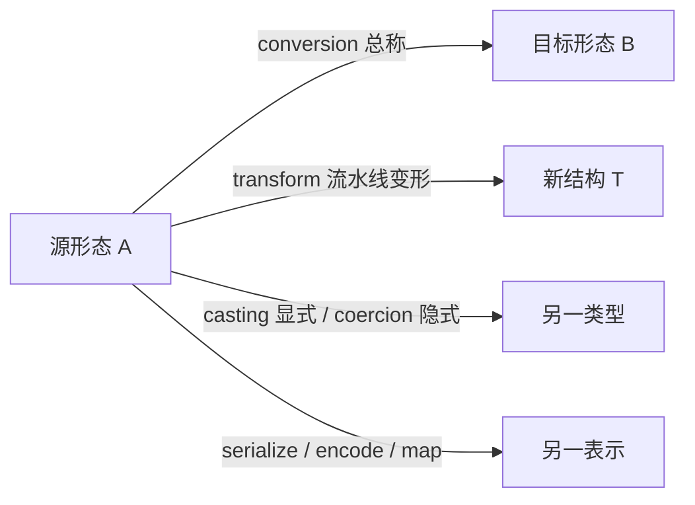
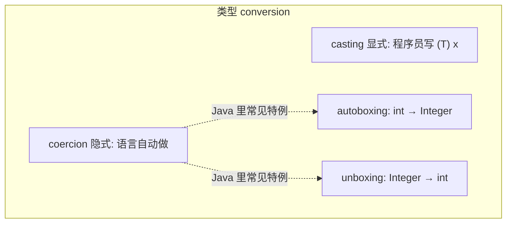

# 转换 / 变换 相关单词及含义

词库 [`data/interview.json`](../data/interview.json) 里，和 **转换 / 变换** 相关的词主要分两类：类型标签怎么换，以及数据换一种载体或结构。

核心差别：

- **conversion**：总称，A 变成 B（类型、格式、表示都可以）。
- **transform**：流水线式变形，强调过程，不特指类型标签。
- **casting vs coercion**：都是类型转换，差别在**谁发起**——程序员写出来 vs 语言自动做。



---

## 1. 类型转换家族（Programming Basics）

这组说的是：**值还是那个值（或等价表示），类型标签怎么换**。

| 单词 | 词库释义 | 编程含义 |
|---|---|---|
| [conversion](../data/interview.json)（id 40） | 转换 | 总称。把值从一种类型/表示变成另一种。可隐式或显式 |
| [casting](../data/interview.json)（id 28） | 类型转换 | **显式**。代码里写出来：`(String) obj`、`(int) 3.14` |
| [coercion](../data/interview.json)（id 32，已标错词） | 强制转换 | **隐式**。语言/编译器自动做，代码里看不到 cast 语法。见下一节 |
| [autoboxing](../data/interview.json)（id 24） | 自动装箱 | 基本类型 → 包装类，`int` → `Integer`（一种特殊的 coercion） |
| [unboxing](../data/interview.json)（id 134） | 自动拆箱 | 包装类 → 基本类型，`Integer` → `int`（反向；`null` 会 NPE） |
| [wrapper](../data/interview.json)（id 141，已收藏） | 包装类 | 装箱目标：`Integer`、`Long`、`Boolean`；也泛指包一层的包装 |



---

## 2. coercion 到底是什么？

词库中文写的是「强制转换」，和中文教材里常说的「强制类型转换」(cast) **撞车**，所以容易背反。

| | casting | coercion |
|---|---|---|
| 谁发起 | **程序员**写 cast 语法 | **语言**自动做 |
| 代码里看不看得见 | 看得见：`(int) x`、`as Int` | 通常看不见 |
| 中文更稳妥的说法 | 显式类型转换 / 强制类型转换 | 隐式类型转换 / 类型强制 |
| 英文口诀 | cast = 我来转 | coerce = 语言逼着转 |

**coercion** 本义是「胁迫、强制」：类型系统不允许的搭配，语言先悄悄改成允许的类型，再继续算。

例子：

```text
// JavaScript：字符串被 coerce 成数字（或反过来）
"1" + 2          → "12"     // 2 被 coerce 成 "2"
"1" - 2          → -1       // "1" 被 coerce 成 1

// Java：拓宽转换是隐式 coercion
int i = 1;
long L = i;      // int → long，程序员没写 cast

// Java：autoboxing 也是一种 coercion
List<Integer> list = new ArrayList<>();
list.add(1);     // 1 被自动装箱成 Integer
```

和 casting 对照：

```text
// casting：你明确要求按另一类型看
Object o = "hi";
String s = (String) o;   // 显式 cast；错了运行期 ClassCastException

double d = 3.9;
int n = (int) d;         // 显式截断；不是语言偷偷做的
```

记忆：

- **cast** = 我动手改类型标签
- **coerce** = 语言偷偷改类型标签
- 词库「强制转换」更贴 **coercion** 的英文词根，但和中文口语「强制类型转换 = cast」冲突。背的时候用：**coercion = 隐式强制，casting = 显式转换**

---

## 3. 数据形态转换

这组说的是：**同一个信息，换一种载体或结构**。词库里 `transform` 的中文也是「转换」，和 `conversion` 看起来一样，场景不同。

| 单词 | 词库释义 | 分类 | 含义 |
|---|---|---|---|
| [transform](../data/interview.json)（id 130） | 转换 | Programming Basics | 输入变成另一种结构再输出。Stream `map`/`flatMap`、ETL、图形矩阵。强调**过程**，不是类型标签 |
| [serialize](../data/interview.json)（id 121） | 序列化 | Programming Basics | 对象 → 可传输/可存储的字节或文本 |
| [deserialize](../data/interview.json)（id 47，已收藏） | 反序列化 | Programming Basics | 字节/文本 → 对象 |
| [parse](../data/interview.json)（id 104） | 解析 | Programming Basics | 从文本读出结构：`parseInt`、JSON/SQL parser。不完全等于 convert |
| [encoding](../data/interview.json)（id 341） | 编码 | Databases | 字符/字节怎么表示：UTF-8、GBK、Base64 |
| [map](../data/interview.json)（id 191） | 映射 | Data Structures & Algorithms | 每个元素变成另一个；也指 `Map<K,V>` |
| [mapping](../data/interview.json)（id 571） | 映射 | Java Ecosystem | ORM / DTO 字段对应：entity ↔ table、JSON ↔ 对象 |
| [mappings](../data/interview.json)（id 572） | 映射 | Java Ecosystem | mapping 的复数，配置里常写 `mappings` |
| [mapper](../data/interview.json)（id 798） | 映射器 | Distributed Systems | 执行 mapping 的组件：MyBatis、MapStruct、MapReduce Mapper |
| [adapter](../data/interview.json)（id 861） | 适配器 | Architecture & Design | 接口转换：A 包一层看起来像 B（GoF Adapter） |

对照：

- **serialize / encode**：换载体
- **map / mapping**：换字段或换元素
- **adapter**：换接口
- **parse**：从半结构里**读出**结构

---

## 4. 容易混进来、但不是「类型/形态转换」

| 单词 | 词库释义 | 为何单独说 |
|---|---|---|
| [context-switch](../data/interview.json)（id 415） | 上下文切换 | CPU **换过去**跑另一个任务，不是把值变成另一种类型 |
| [exchange](../data/interview.json)（id 695） | 交换机 | 消息队列路由组件，不是「兑换/转换」 |
| [mutation-test](../data/interview.json)（id 1207） | 变异测试 | 故意改代码看测试会不会挂，不是 convert |

型变（covariance / contravariance / invariance / variance）描述的是**子类型关系怎么跟着泛型走**，不是值的转换。见 [Variance 相关单词及含义](./Variance%20相关单词及含义.md)。

---

## 5. 词库里没有的相关形态

未收录：动词 **convert**、**converter**、动词 **cast**（只有名词 casting）、**encode / decode / codec / transcode**、**transformation / transformer**。

若要补全：可加 `convert`（v. 转换）与现有 `conversion` 成对。
